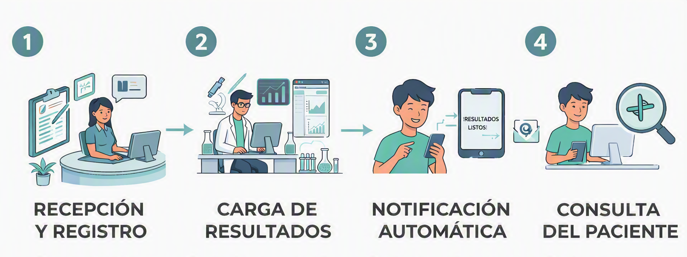

<p align=center>

</p>
<p align=center> <strong>Portal de resultados y seguimiento de órdenes para laboratorios de análisis clínicos</strong> </p>

<p align=center> <a href="docs/propuesta.md"> Propuesta de Proyecto</a> • <a href="#créditos"> Créditos </p>

<p align=center> <a href="https://www.utn.edu.ar" >
    
</a> </p>

---

## 🧾 Descripción

**LabResultados** es un sistema web que permite a los pacientes de un laboratorio de análisis clínicos **consultar el estado de sus estudios y acceder a sus resultados de forma online**.

A su vez, permite al personal del laboratorio **registrar órdenes, cargar resultados y gestionar su estado** de manera centralizada.

## ⚠️ Problema

En laboratorios pequeños y medianos, los pacientes no siempre tienen una forma sencilla de saber si sus estudios ya están disponibles. Esto genera consultas frecuentes por teléfono o presenciales, como *"¿Ya están mis análisis?"*, lo que puede provocar una mayor carga de trabajo en recepción.

Además, la entrega de resultados suele realizarse en formato físico o mediante el envío manual de archivos PDF, por ejemplo, a través de WhatsApp.

## 💡 Solución

<p align=center>

</p>

**LabResultados** propone un portal web que centraliza la gestión y consulta de los estudios:

1. La **recepción** registra las órdenes de los pacientes.
2. El **bioquímico** carga los resultados y actualiza el estado de los estudios.
3. Cuando los resultados están disponibles, el paciente recibe una **notificación por correo electrónico**.
4. El **paciente** consulta el estado de su orden y accede a sus resultados mediante un código de orden o DNI.


## 📍 Alcance

El sistema contempla:

- Registro y gestión de órdenes.
- Carga de resultados estructurados: analito, valor, unidad y rango de referencia.
- Gestión de estados de la orden: **En proceso → Listo → Entregado**.
- Consulta de órdenes y resultados por parte del paciente.
- Resaltado de valores fuera del rango de referencia.
- Consulta del historial de resultados.
- Notificación por correo electrónico cuando los resultados están disponibles.

## 💻 Stack tecnológico

### Frontend
<p>
  
  &nbsp;&nbsp;
  
  &nbsp;&nbsp;
  
  &nbsp;&nbsp;
  
</p>

### Backend
<p>
  
  &nbsp;&nbsp;
  
</p>

### Base de datos e infraestructura
<p>
  
  &nbsp;&nbsp;
  
</p>

## 🗓️ Plan de trabajo

Desarrollar un MVP funcional de portal de resultados y seguimiento de órdenes, desplegado online, en 3 etapas:
| Etapa | Fecha máxima | Entregable |
|---|---|---|
| 1.ª Entrega | 30/08 | Propuesta + plan de trabajo + URL del repositorio |
| 2.ª Entrega | 27/09 | Esquema de base de datos + listado de módulos |
| Entrega Final | 14/11 | Repo completo, despliegue online, informe y video |

## 📖 Documentación

Documentación completa disponible en [`docs`](docs/)

## 📂 Estructura del repositorio 
```
labresultados/
├── backend/     # API REST (Spring Boot)
├── frontend/    # Interfaz web (HTML/CSS/JS)
├── database/    # Scripts DDL/DML, esquema y migraciones
├── docs/        # Propuesta, informes y documentación
└── README.md
```

## Créditos
**Grupo 111:** [Ariel Grela](https://github.com/AriGrela) • [Matías N. Higa](https://github.com/emegiga) 

**Tutor:** Fonzo, Santiago

---

<p align="center">
  <sub>2026 · Trabajo Final - Tecnicatura Universitaria en Programación a Distancia</sub><br>
</p>
