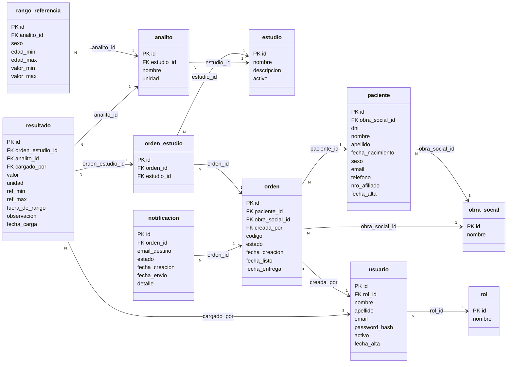

# Diagrama Entidad-Relación

Esquema relacional de **LabResultados** (PostgreSQL). El script que lo crea está en [`01_schema.sql`](01_schema.sql).

## Cómo leer el diagrama

- Cada caja es una **tabla**: `PK` es la clave primaria y `FK` las claves foráneas.
- Cada **flecha** es una relación **N:1 (muchos a uno)**. Sale de la tabla que tiene la clave foránea (**N**) y apunta a la tabla referenciada (**1**).
- El texto sobre la flecha es la columna que las une.

Ejemplo: `orden "N" → "1" paciente` se lee *"muchas órdenes pertenecen a un paciente"* (o al revés: *"un paciente tiene muchas órdenes"*).

> Versión en imagen: [`docs/images/diagrama-er.png`](../docs/images/diagrama-er.png)

## Relaciones

| Desde (N) | Hacia (1) | Clave foránea | Se lee |
| --- | --- | --- | --- |
| usuario | rol | `rol_id` | Cada usuario tiene un único rol; un rol lo pueden tener muchos usuarios |
| paciente | obra_social | `obra_social_id` | Un paciente tiene (opcionalmente) una cobertura actual |
| orden | paciente | `paciente_id` | Un paciente puede tener muchas órdenes |
| orden | obra_social | `obra_social_id` | Cada orden registra la cobertura usada en ese momento |
| orden | usuario | `creada_por` | Cada orden la registra un usuario de recepción |
| orden_estudio | orden | `orden_id` | Una orden incluye uno o más estudios |
| orden_estudio | estudio | `estudio_id` | Un estudio puede pedirse en muchas órdenes |
| analito | estudio | `estudio_id` | Un estudio se compone de uno o más analitos |
| rango_referencia | analito | `analito_id` | Un analito puede tener varios rangos (por sexo/edad) |
| resultado | orden_estudio | `orden_estudio_id` | Cada resultado corresponde a un estudio pedido en una orden |
| resultado | analito | `analito_id` | Cada resultado mide un analito |
| resultado | usuario | `cargado_por` | Cada resultado lo carga un bioquímico |
| notificacion | orden | `orden_id` | Una orden puede tener varios avisos (ej.: un reintento) |

### Relación N:M entre orden y estudio

Una orden puede incluir **muchos** estudios y un mismo estudio se pide en **muchas** órdenes. Esa relación muchos a muchos se resuelve con la tabla intermedia **`orden_estudio`**, que la descompone en dos relaciones N:1.

## Tablas por módulo

Cada tabla la administra uno de los módulos definidos en [`docs/modulos.md`](../docs/modulos.md):

| Módulo | Tablas |
| --- | --- |
| Gestión de usuarios y roles | `rol`, `usuario` |
| Gestión de pacientes | `paciente`, `obra_social` |
| Administración de estudios | `estudio`, `analito`, `rango_referencia` |
| Gestión de órdenes | `orden`, `orden_estudio` |
| Gestión de resultados | `resultado` |
| Consulta e Historial de resultados | `vista_historial_resultados` (solo lectura) |
| Notificaciones | `notificacion` |

## Decisiones de diseño

- **El resultado guarda una copia de la unidad y del rango aplicado** (`unidad`, `ref_min`, `ref_max`). Así un resultado viejo se sigue interpretando igual aunque después cambie la configuración del estudio (regla del módulo *Historial de resultados*).
- **`fuera_de_rango` lo calcula la base de datos** (columna generada): no depende de que el código se acuerde de marcarlo.
- **Rangos por sexo y edad**: un analito puede tener varios rangos (ej.: la hemoglobina normal es distinta en hombres y mujeres). Por eso el paciente tiene `sexo` y `fecha_nacimiento`.
- **Obra social en el paciente y en la orden**: el paciente guarda su cobertura *actual*; la orden guarda la que se usó *en ese momento*, por si el paciente cambia de obra social.
- **Una orden con resultados no se puede borrar**: la base lo impide para no perder información clínica.
- **Acceso del paciente con código + DNI**: el código de orden es aleatorio (no correlativo) para que no se pueda adivinar. Contraseñas del personal guardadas como hash BCrypt. Ver *Protección de datos y marco legal* en la propuesta.
- **La vista de historial solo muestra órdenes `LISTO` o `ENTREGADO`**: una orden en proceso no le muestra resultados al paciente.
