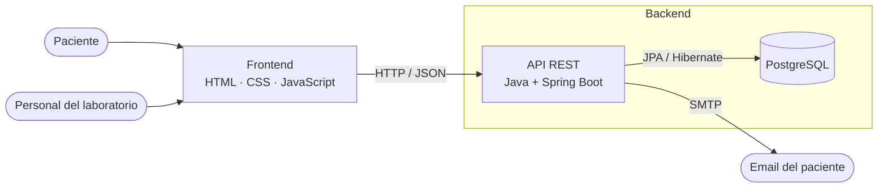
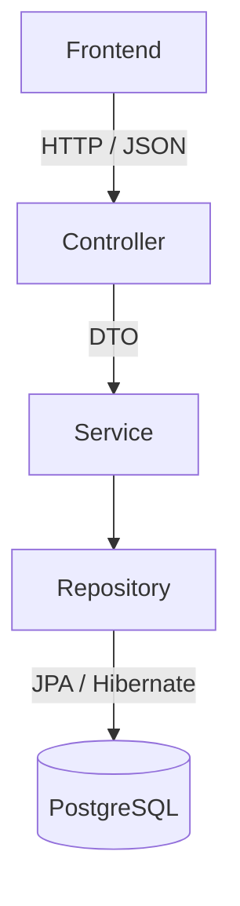

# Arquitectura del sistema

## 1. Arquitectura macro

El sistema se divide en dos grandes componentes que se comunican por HTTP:

- **Frontend**: la interfaz web (HTML, CSS y JavaScript) que usan el personal del laboratorio y los pacientes.
- **Backend**: una **API REST** en Java + Spring Boot, junto con la **base de datos** PostgreSQL donde se guarda la información.



En desarrollo, el backend y la base se levantan con Docker Compose. Para el MVP en la nube: frontend estático (Vercel o Netlify), backend en Render y base de datos en Supabase.

## 2. Estilo arquitectónico: monolito modular en capas

**Elegimos un monolito modular organizado en capas.**

- **Monolito**: todo el backend es una sola aplicación Spring Boot que se despliega como una unidad.
- **Modular**: por dentro, el código se divide en un paquete por cada módulo del [listado de módulos](modulos.md). Cada módulo tiene límites claros y es dueño de sus tablas.
- **En capas**: dentro de cada módulo, el código se separa en capas con responsabilidades distintas (controlador, servicio y repositorio).

### ¿Por qué este estilo?

| Alternativa | ¿La elegimos? | Motivo |
| --- | --- | --- |
| Monolito modular en capas | ✅ Sí | Simple de desplegar y mantener para un equipo de dos. Los módulos permiten repartir el trabajo y mantener el código ordenado. |
| Microservicios | ❌ No | Sobreingeniería para un laboratorio chico: varios despliegues, comunicación en red entre servicios y más infraestructura, sin un beneficio real a esta escala. |
| MVC clásico con vistas en el servidor (ej.: Thymeleaf) | ❌ No | El frontend es independiente y consume la API REST. Igual conservamos la idea de MVC: el *modelo* son las entidades y DTOs, el *controlador* es el controller REST y la *vista* es el frontend. |
| Arquitectura hexagonal / clean | ❌ No | Suma capas de abstracción y una curva de aprendizaje que el MVP no necesita. |

Además, es el enfoque que vimos en la cursada (Spring Boot, JPA, DTOs y APIs REST en Programación III), en línea con el criterio de elegir lo que el equipo ya domina.

Si en el futuro un módulo creciera mucho (por ejemplo, Notificaciones), el diseño modular permitiría separarlo sin reescribir el resto.

## 3. Organización del backend

### Capas



| Capa | Responsabilidad | Ejemplo |
| --- | --- | --- |
| **Controller** | Recibe la petición HTTP, valida los datos de entrada y devuelve la respuesta en JSON. No contiene reglas de negocio. | `OrdenController` expone `POST /api/ordenes` |
| **Service** | Contiene las **reglas de negocio** y coordina con otros módulos. | `ResultadoService` elige el rango de referencia según el sexo y la edad del paciente y, al completar la carga, pasa la orden a `LISTO` |
| **Repository** | Accede a la base de datos con Spring Data JPA. | `OrdenRepository.findByCodigo(...)` |
| **Entity** | Clases que representan las tablas (mapeo JPA). | `Orden`, `Resultado` |
| **DTO** | Objetos que entran y salen por la API. Evitan exponer las entidades (por ejemplo, nunca se envía el `password_hash`). | `OrdenRequest`, `ResultadoResponse` |

### Paquetes: uno por módulo

```
backend/src/main/java/ar/edu/utn/labresultados/
├── LabResultadosApplication.java
├── usuarios/          → Gestión de usuarios y roles
│   ├── UsuarioController.java
│   ├── UsuarioService.java
│   ├── UsuarioRepository.java
│   ├── Usuario.java
│   ├── Rol.java
│   └── dto/
├── pacientes/         → Gestión de pacientes
├── estudios/          → Administración de estudios (estudio, analito, rango)
├── ordenes/           → Gestión de órdenes
├── resultados/        → Gestión de resultados
├── consulta/          → Consulta de resultados (portal del paciente)
├── historial/         → Historial de resultados
├── notificaciones/    → Notificaciones por email
└── comun/             → Configuración, seguridad y manejo de errores
```

Cada paquete repite la misma estructura interna que `usuarios/` (controller, service, repository, entidades y DTOs).

### Reglas de convivencia entre módulos

- Un módulo **no accede a los repositorios de otro**: si necesita algo, llama a su **servicio**. Ej.: `ResultadoService` le pide a `OrdenService` que cambie el estado de la orden.
- Cuando una orden pasa a `LISTO`, el módulo de órdenes le pide a `NotificacionService` que genere el aviso.
- Lo transversal (seguridad, errores, configuración) vive en `comun/`.

### Seguridad

- **Personal del laboratorio**: inicio de sesión con email y contraseña (guardada como hash BCrypt) con Spring Security. Cada endpoint se habilita según el rol: `ADMINISTRADOR`, `RECEPCION` o `BIOQUIMICO`.
- **Paciente**: accede sin cuenta, con **código de orden + DNI**, y solo puede ver esa orden y su propio historial (ver *Protección de datos y marco legal* en la propuesta).

## 4. Organización del frontend

Frontend en HTML, CSS y JavaScript, sin framework, organizado **por pantallas según el actor** que las usa. Toda la comunicación con el backend pasa por un único archivo (`api.js`).

```
frontend/
├── index.html              → acceso del paciente (código de orden + DNI)
├── paciente/
│   ├── orden.html          → estado y resultados de la orden
│   └── historial.html      → resultados anteriores y evolución
├── personal/
│   ├── login.html
│   ├── recepcion/          → pacientes y órdenes
│   ├── bioquimico/         → carga de resultados
│   └── admin/              → usuarios y estudios
├── js/
│   ├── api.js              → único punto de llamadas a la API REST (fetch)
│   ├── auth.js             → sesión del personal
│   └── ...                 → un archivo por pantalla
└── css/
```

## 5. Resumen: de cada módulo a su código y sus tablas

| Módulo | Paquete backend | Pantallas frontend | Tablas |
| --- | --- | --- | --- |
| Gestión de usuarios y roles | `usuarios` | `personal/admin` | `usuario`, `rol` |
| Gestión de pacientes | `pacientes` | `personal/recepcion` | `paciente`, `obra_social` |
| Gestión de órdenes | `ordenes` | `personal/recepcion` | `orden`, `orden_estudio` |
| Gestión de resultados | `resultados` | `personal/bioquimico` | `resultado` |
| Consulta de resultados | `consulta` | `index.html`, `paciente/orden.html` | `vista_historial_resultados` |
| Historial de resultados | `historial` | `paciente/historial.html` | `vista_historial_resultados` |
| Notificaciones | `notificaciones` | — (lo dispara el sistema) | `notificacion` |
| Administración de estudios | `estudios` | `personal/admin` | `estudio`, `analito`, `rango_referencia` |

El detalle de cada tabla y sus relaciones está en el [diagrama entidad-relación](../database/diagrama-er.md).
