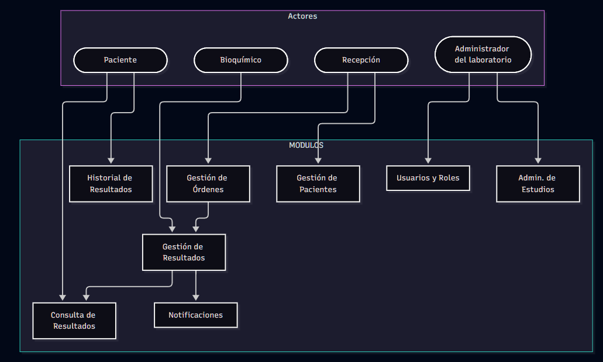

# Listado de Módulos

| Módulo                          | Actor principal | Propósito                                                          |
| ------------------------------- | --------------- | ------------------------------------------------------------------ |
| **[**Gestión de usuarios y roles**](#gestión-de-usuarios-y-roles)** | Administrador del laboratorio   | Gestionar los usuarios internos y sus permisos                     |
| **[**Gestión de pacientes**](#gestión-de-pacientes)**        | Recepción       | Registrar y consultar los datos del paciente                       |
| **[**Gestión de órdenes**](#gestión-de-órdenes)**          | Recepción       | Registrar estudios solicitados y administrar el estado de la orden |
| **[**Gestión de resultados**](#gestión-de-resultados)**       | Profesional (Bioquímico)      | Cargar los resultados de los estudios                              |
| **[**Consulta de resultados**](#consulta-de-resultados)**      | Paciente        | Consultar el estado y visualizar resultados                        |
| **[**Historial de resultados**](#historial-de-resultados)**                   | Paciente        | Consultar resultados anteriores                                    |
| **[**Notificaciones**](#notificaciones)**              | Sistema         | Avisar al paciente cuando sus resultados estén disponibles         |
| **[**Administración de estudios**](#administración-de-estudios)**  | Administrador del laboratorio  | Configurar estudios, analitos y rangos de referencia               |

---
### Gestión de órdenes

**Objetivo:**
Permitir al personal de recepción registrar y gestionar las órdenes correspondientes a los estudios solicitados por cada paciente.

**Actor/es involucrado/s:**

* Actor principal: Administrativo / Recepción.
* Entidades relacionadas: Paciente, Obra Social, Estudio.

**Funcionalidades principales:**

* Registrar una nueva orden.
* Asociar la orden a un paciente.
* Registrar los estudios solicitados.
* Registrar la obra social del paciente como dato asociado a la orden.
* Generar un código de orden.
* Consultar una orden.
* Gestionar el estado de la orden.

**Datos involucrados:**

* Paciente.
* Orden.
* Estudio.
* Obra social.
* Estado de la orden.
* Fecha de la orden.

**Reglas de negocio:**

* Una orden debe estar asociada a un paciente.
* Una orden debe contener uno o más estudios.
* La obra social se registra únicamente como dato asociado al paciente/orden.
* La orden atraviesa los estados definidos por el sistema: `En proceso → Listo → Entregado`.

**Interacción con otros módulos:**

* Se relaciona con **Gestión de pacientes** para identificar al paciente asociado a la orden.
* Se relaciona con **Administración de estudios** para seleccionar los estudios solicitados.
* Se relaciona con **Gestión de resultados** para asociar los resultados correspondientes a los estudios de la orden.
* Se relaciona con **Notificaciones** cuando la orden pasa al estado `Listo`.

**Resultado esperado:**
Una orden correctamente registrada, asociada a un paciente y a los estudios solicitados, con un código que permita posteriormente consultar su estado y resultados.

---
### Gestión de usuarios y roles

**Objetivo:**

Permitir al administrador del laboratorio gestionar los usuarios internos del sistema y los roles que determinan sus permisos de acceso.

**Actor/es involucrado/s:**

* Actor principal: Administrador del laboratorio.
* Actores relacionados: Recepción, Profesional (Bioquímico).

**Funcionalidades principales:**

* Registrar un nuevo usuario interno.
* Consultar usuarios registrados.
* Modificar los datos de un usuario.
* Asignar un rol a un usuario.
* Gestionar el acceso de los usuarios al sistema.

**Datos involucrados:**

* Usuario.
* Nombre y datos identificatorios.
* Credenciales de acceso.
* Rol.
* Estado del usuario.

**Reglas de negocio:**

* Los usuarios internos deben tener un rol asignado.
* Los roles determinan las funcionalidades a las que puede acceder cada usuario.
* Los roles contemplados son: Administrador, Recepción y Profesional (Bioquímico).

**Interacción con otros módulos:**

* Se relaciona con **Gestión de órdenes** para controlar las operaciones disponibles para el personal de recepción.
* Se relaciona con **Gestión de resultados** para controlar las operaciones disponibles para el profesional.
* Se relaciona con **Administración de estudios** para controlar las operaciones disponibles para el administrador.

**Resultado esperado:**

Un conjunto de usuarios internos correctamente registrados y asociados a un rol que permita controlar su acceso a las funcionalidades del sistema.

---

### Gestión de pacientes

**Objetivo:**

Permitir al personal de recepción registrar y consultar los datos necesarios de los pacientes que utilizan los servicios del laboratorio.

**Actor/es involucrado/s:**

* Actor principal: Recepción.
* Entidades relacionadas: Obra Social, Orden.

**Funcionalidades principales:**

* Registrar un nuevo paciente.
* Consultar los datos de un paciente.
* Modificar los datos registrados de un paciente.
* Identificar al paciente mediante sus datos personales.
* Consultar las órdenes asociadas a un paciente.

**Datos involucrados:**

* Paciente.
* Nombre y apellido.
* DNI.
* Datos de contacto.
* Obra social.
* Órdenes asociadas.

**Reglas de negocio:**

* Un paciente puede tener una o más órdenes.
* Los datos del paciente deben permitir identificarlo de forma inequívoca.
* La obra social se registra como dato del paciente y no implica funcionalidades de facturación.

**Interacción con otros módulos:**

* Se relaciona con **Gestión de órdenes** para asociar las órdenes al paciente.
* Se relaciona con **Consulta de resultados** para identificar al paciente que realiza una consulta.
* Se relaciona con **Historial de resultados** para recuperar los resultados anteriores asociados al paciente.

**Resultado esperado:**

Un registro de paciente correctamente almacenado que permita identificarlo y relacionarlo con sus órdenes y resultados.

---

### Gestión de resultados

**Objetivo:**

Permitir al profesional del laboratorio cargar y gestionar los resultados correspondientes a los estudios incluidos en una orden.

**Actor/es involucrado/s:**

* Actor principal: Profesional (Bioquímico).
* Entidades relacionadas: Orden, Estudio, Analito.

**Funcionalidades principales:**

* Consultar órdenes pendientes de resultados.
* Seleccionar una orden para cargar sus resultados.
* Registrar el valor obtenido para cada analito.
* Registrar la unidad correspondiente.
* Consultar el rango de referencia del analito.
* Identificar automáticamente valores fuera del rango de referencia.
* Finalizar la carga de resultados.
* Actualizar el estado de la orden cuando los resultados estén disponibles.

**Datos involucrados:**

* Orden.
* Estudio.
* Analito.
* Resultado.
* Valor.
* Unidad.
* Rango de referencia.
* Estado de la orden.

**Reglas de negocio:**

* Los resultados se registran asociados a una orden y a los estudios correspondientes.
* Cada resultado debe contener un valor y su unidad correspondiente.
* Los valores deben compararse con el rango de referencia configurado para el analito.
* Los valores fuera del rango de referencia deben ser identificados automáticamente.
* Cuando los resultados estén disponibles, la orden puede pasar al estado `Listo`.

**Interacción con otros módulos:**

* Se relaciona con **Gestión de órdenes** para obtener las órdenes y estudios pendientes.
* Se relaciona con **Administración de estudios** para obtener los analitos y rangos de referencia.
* Se relaciona con **Consulta de resultados** para permitir posteriormente la visualización de los resultados por parte del paciente.
* Se relaciona con **Notificaciones** cuando los resultados pasan a estar disponibles.

**Resultado esperado:**

Una orden con sus resultados correctamente registrados y asociados a los estudios correspondientes, identificando los valores que se encuentren fuera del rango de referencia.

---

### Consulta de resultados

**Objetivo:**

Permitir al paciente consultar el estado de su orden y acceder a sus resultados cuando estos se encuentren disponibles, sin requerir intervención del personal del laboratorio.

**Actor/es involucrado/s:**

* Actor principal: Paciente.
* Entidades relacionadas: Orden, Resultado.

**Funcionalidades principales:**

* Ingresar el código de orden y/o DNI.
* Consultar el estado de una orden.
* Visualizar los resultados disponibles.
* Identificar los valores fuera del rango de referencia.
* Acceder a la información correspondiente a los estudios realizados.

**Datos involucrados:**

* Paciente.
* DNI.
* Código de orden.
* Orden.
* Estudio.
* Resultado.
* Valor.
* Unidad.
* Rango de referencia.
* Estado de la orden.

**Reglas de negocio:**

* El paciente únicamente debe poder acceder a la información correspondiente a su propia orden.
* Los resultados deben estar disponibles para su consulta cuando la orden se encuentre en estado `Listo`.
* Los valores fuera del rango de referencia deben visualizarse diferenciados.
* Una orden que todavía se encuentre `En proceso` no debe mostrar resultados que aún no estén disponibles.

**Interacción con otros módulos:**

* Se relaciona con **Gestión de pacientes** para identificar al paciente.
* Se relaciona con **Gestión de órdenes** para consultar el estado de la orden.
* Se relaciona con **Gestión de resultados** para obtener los resultados disponibles.
* Se relaciona con **Historial de resultados** para consultar resultados anteriores.

**Resultado esperado:**

El paciente puede conocer el estado de su orden y, cuando los resultados están disponibles, visualizarlos de forma directa y estructurada.

---

### Historial de resultados

**Objetivo:**

Permitir al paciente consultar los resultados de estudios realizados anteriormente y disponer de un historial asociado a sus órdenes.

**Actor/es involucrado/s:**

* Actor principal: Paciente.
* Entidades relacionadas: Paciente, Orden, Resultado, Estudio.

**Funcionalidades principales:**

* Consultar el historial de resultados del paciente.
* Visualizar las órdenes anteriores.
* Consultar los resultados asociados a una orden anterior.
* Consultar los estudios realizados en cada orden.

**Datos involucrados:**

* Paciente.
* Orden.
* Estudio.
* Resultado.
* Fecha.
* Valor.
* Unidad.
* Rango de referencia.

**Reglas de negocio:**

* El historial debe contener únicamente información correspondiente al paciente autenticado/identificado.
* Los resultados deben mantenerse asociados a la orden en la que fueron realizados.
* Cada resultado debe conservar la información necesaria para su interpretación, incluyendo valor, unidad y rango de referencia.

**Interacción con otros módulos:**

* Se relaciona con **Gestión de pacientes** para identificar al paciente.
* Se relaciona con **Gestión de órdenes** para obtener las órdenes anteriores.
* Se relaciona con **Gestión de resultados** para obtener los resultados asociados a cada orden.
* Forma parte de la consulta realizada desde **Consulta de resultados**.

**Resultado esperado:**

El paciente puede consultar sus resultados anteriores y visualizar la evolución de los estudios realizados a lo largo del tiempo.

---

### Notificaciones

**Objetivo:**

Informar al paciente cuando los resultados correspondientes a su orden se encuentren disponibles.

**Actor/es involucrado/s:**

* Actor principal: Sistema.
* Actor secundario: Paciente.

**Funcionalidades principales:**

* Detectar cuando una orden pasa al estado `Listo`.
* Obtener los datos de contacto del paciente.
* Generar una notificación de disponibilidad.
* Enviar la notificación mediante correo electrónico.

**Datos involucrados:**

* Paciente.
* Orden.
* Estado de la orden.
* Dirección de correo electrónico.
* Fecha y hora de la notificación.

**Reglas de negocio:**

* La notificación se genera cuando los resultados de una orden pasan a estar disponibles.
* La notificación se envía al correo electrónico registrado para el paciente.
* La notificación debe informar al paciente que sus resultados están disponibles para ser consultados.

**Interacción con otros módulos:**

* Se relaciona con **Gestión de órdenes** para detectar el cambio de estado.
* Se relaciona con **Gestión de pacientes** para obtener los datos de contacto.
* Se relaciona con **Consulta de resultados** para que el paciente pueda acceder a sus resultados luego de recibir la notificación.

**Resultado esperado:**

El paciente recibe un aviso por correo electrónico cuando sus resultados están disponibles y puede acceder al sistema para consultarlos.

---

### Administración de estudios

**Objetivo:**

Permitir al administrador del laboratorio configurar los estudios, analitos y rangos de referencia utilizados por el sistema.

**Actor/es involucrado/s:**

* Actor principal: Administrador del laboratorio.
* Entidades relacionadas: Estudio, Analito, Rango de referencia.

**Funcionalidades principales:**

* Registrar estudios.
* Consultar estudios configurados.
* Modificar los datos de un estudio.
* Registrar los analitos asociados a un estudio.
* Configurar los rangos de referencia de los analitos.
* Consultar la configuración de los estudios.

**Datos involucrados:**

* Estudio.
* Analito.
* Unidad.
* Rango de referencia.
* Valores de referencia.

**Reglas de negocio:**

* Un estudio puede estar compuesto por uno o más analitos.
* Cada analito debe contar con la información necesaria para registrar e interpretar su resultado.
* Los rangos de referencia configurados serán utilizados para identificar valores fuera de rango durante la carga de resultados.

**Interacción con otros módulos:**

* Se relaciona con **Gestión de órdenes** para proporcionar los estudios que pueden ser solicitados.
* Se relaciona con **Gestión de resultados** para proporcionar los analitos, unidades y rangos de referencia necesarios para cargar los resultados.
* Se relaciona indirectamente con **Consulta de resultados**, ya que la información configurada permite interpretar y mostrar los resultados al paciente.

**Resultado esperado:**

Un catálogo de estudios correctamente configurado, con sus analitos y rangos de referencia disponibles para ser utilizados durante el registro de órdenes y la carga de resultados.
