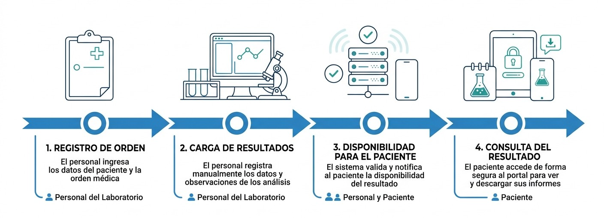

# Propuesta de Proyecto

| Entrega #1                  |                                                                                                                                |
| :-------------------------- | :----------------------------------------------------------------------------------------------------------------------------- |
| **Nombre del proyecto**     | **LabResultados**                                                                                                              |
| **Plazo máximo de entrega** | 30/08                                                                                                                          |
| **Grupo**                   | Grupo 111                                                                                                                      |
| **Integrantes**             | • Grela, Ariel • Higa, Matías                                                                                               |
| **Tutor**                   | Fonzo, Santiago                                                                                                                |
| **Materia**                 | Trabajo Final                                                                                                                  |
| **Carrera**                 | Tecnicatura Universitaria en Programación a Distancia                                                                          |
| **Institución**             |  |

---

## Índice

1. [Contexto y problema](#1-contexto-y-problema)
2. [Elicitación de Requisitos](#2-elicitación-de-requisitos)

   * [2.1 Actores involucrados](#21-actores-involucrados)
   * [2.2 Flujo actual](#22-flujo-actual)
3. [Propuesta de solución](#3-propuesta-de-solución)

   * [3.1 Stack tecnológico](#31-stack-tecnológico)
   * [3.2 Arquitectura](#32-arquitectura)
4. [Alcance](#4-alcance)

   * [4.1 MVP](#41-mvp)
   * [4.2 Nice to have](#42-nice-to-have-si-sobra-tiempo)
   * [4.3 Fuera de alcance](#43-fuera-de-alcance)
5. [Plan de trabajo](#6-plan-de-trabajo)
6. [Viabilidad](#7-viabilidad)

   * [6.1 Técnica](#61-técnica)
   * [6.2 Temporal](#62-temporal)
   * [6.3 Conocimientos](#63-conocimientos)
7. [Análisis de competencia y diferenciación](#7-análisis-de-competencia-y-diferenciación)
8. [Uso crítico de IA](#8-uso-crítico-de-ia)
9. [Protección de datos y marco legal](#9-protección-de-datos-y-marco-legal)

---

## 1. Contexto y problema

**Contexto:** Un laboratorio de análisis clínicos chico/mediano (de barrio) atiende entre 20 y 25 pacientes por día. La toma de muestra es por orden de llegada (no se usan turnos) y los resultados se procesan a lo largo de uno o varios días.

**Problema:** El sector de administrativo del laboratorio se ve saturado por las siguientes tareas:
1. Los pacientes no tienen forma de saber si sus estudios ya están listos, ni porqué medio los recibirán. 
2. En consecuencia, el laboratorio recibe llamados y/o visitas de los pacientes para consultar el estado de sus estudios.
3. La entrega de resultados es un proceso manual: Recepción se encarga de imprimir en papel o se enviar como PDF por WhatsApp/email cada uno.
El flujo de trabajo actual desborda a los administrativos del laboratorio (consultas, entrega de resultados, gestión diaria, atención de los pacientes del día).

**Impacto medible (relevamiento en un laboratorio real):**

* **6 a 10 consultas por día** preguntando por resultados (promedio: **8**).
* **2 a 3 minutos** por consulta → **16 a 24 minutos diarios** de recepción dedicados a esto (promedio: **20 min/día**).
* **10 % a 15 % de los pacientes** concurren antes de que sus resultados estén disponibles → con 20–25 pacientes/día, unos **2 a 3 pacientes diarios** se acercan al laboratorio en vano.

Estas cifras muestran un costo de tiempo concreto y recurrente, tanto para la recepción como para el paciente, que una solución de software puede reducir.

---

## 2. Elicitación de Requisitos

### 2.1 Actores involucrados

| Actor                            | Rol                                                   | Necesidad principal                                         |
| -------------------------------- | ----------------------------------------------------- | ----------------------------------------------------------- |
| Paciente                         | Consulta estado y accede a sus resultados e historial | Saber si están listos y ver/descargar resultados sin llamar |
| Administrativo / Recepción       | Registra la orden del paciente                        | Cargar rápido la orden y sus estudios                       |
| Profesional (Bioquímico/técnico) | Carga resultados y cambia el estado de la orden       | Cargar valores de forma ágil y sin errores                  |
| Administrador del laboratorio    | Configura estudios, analitos y rangos de referencia   | Mantener el catálogo del laboratorio                        |
| Externo - Obra social            | Se registra en la orden como dato del paciente        | Identificar la cobertura (solo dato, sin facturación)       |

### 2.2 Flujo actual

El flujo actual del laboratorio se desarrolla de forma principalmente manual. El paciente no dispone de un mecanismo para consultar el estado de sus estudios, por lo que debe comunicarse con el laboratorio o acercarse personalmente:
1. El paciente llega y se realiza la extracción por orden de llegada.
2. La recepción registra la orden (paciente, estudios) en papel o en una planilla.
3. El laboratorio procesa las muestras; los resultados quedan listos en uno o varios días.
4. El paciente, sin visibilidad del avance, llama o se acerca para preguntar → **8 consultas/día** promedio, **~20 min/día** de recepción, y **2–3 pacientes/día** que vienen antes de tiempo.
5. Cuando están listos, se entregan en papel en el mostrador o por PDF a mano por WhatsApp/email.

**Principales problemas identificados en el flujo actual:**

* El paciente no tiene visibilidad sobre el estado de su orden.
* La recepción recibe consultas repetitivas sobre la disponibilidad de resultados.
* Algunos pacientes se acercan al laboratorio antes de que sus resultados estén disponibles.
* La entrega de resultados se realiza manualmente.
* El envío individual por WhatsApp/email requiere intervención de la recepción.

---

## 3. Propuesta de solución

El **usuario de primera línea del sistema es el laboratorio** (recepción y bioquímico), que es quien gestiona las órdenes y carga los resultados; el **paciente** es un usuario secundario que consulta. Por eso, la solución ataca principalmente dos problemas de estos actores: la **saturación de la recepción** por consultas repetitivas y la **falta de visibilidad del paciente** sobre el estado de sus estudios.

Un portal web donde:

* La recepción **registra la orden** del paciente y sus estudios, generando un **código de orden**.
* El bioquímico **carga los resultados** (valores por analito con su rango de referencia) y actualiza el **estado** de la orden.
* El sistema **avisa por email** al pasar a "listo".
* El paciente **consulta por código de orden / DNI** el estado y, cuando están listos, los resultados con **valores fuera de rango resaltados** y su **historial**.

### 3.1 Stack tecnológico

| Capa          | Elección                                                             | Justificación                                                                                                |
| ------------- | -------------------------------------------------------------------- | ------------------------------------------------------------------------------------------------------------ |
| Backend       | Java + Spring Boot + JPA/Hibernate (Lombok, DTOs, API REST)          | Es el stack que el equipo ya cursa (Programación III). Cero curva de aprendizaje.                            |
| Frontend      | HTML + CSS + JavaScript (TypeScript opcional)                        | También parte del plan de estudios.                                                                          |
| Base de datos | PostgreSQL (relacional / SQL)                                        | Datos estructurados con relaciones fuertes e integridad (ACID). Se integra nativo con JPA.                   |
| Despliegue    | Docker Compose (desarrollo) + nube (Render/Railway + Supabase/Aiven) | Docker iguala entornos entre los dos integrantes. Confirmaremos el resto del stack previo a la 2da entrega (una vez tengamos más claridad del diseño y estructura del proyecto) |

### 3.2 Arquitectura

**Arquitectura macro:** el sistema se divide en dos grandes componentes:

- **Frontend** (HTML/CSS/JS): la interfaz que usan el personal del laboratorio y los pacientes.
- **Backend** (API REST en Spring Boot + base de datos PostgreSQL): expone los servicios y persiste los datos vía JPA/Hibernate.

El estilo arquitectónico (monolito modular en capas) y la organización interna del backend y del frontend se detallan en [Arquitectura del sistema](arquitectura.md).

---

## 4. Alcance

La primera versión (MVP) contempla el circuito completo de gestión de resultados de laboratorio:

La aplicación estará orientada al personal del laboratorio y a los pacientes. 
Permitirá: 
* al **laboratorio**: gestionar las órdenes, cargar y consultar resultados y notificar su disponibilidad.
* a los **pacientes**: saber cuando están sus resultados, y acceder a ellos de forma directa.

#### 4.1 MVP

* Registro de órdenes (paciente + estudios pedidos + obra social como dato).
* Carga de resultados estructurados: Analito (componente), valor, unidad, rango de referencia.
* Estados de la orden: en proceso → listo → entregado.
* Consulta del paciente por código de orden / DNI.
* Resaltado automático de valores fuera de rango.
* Historial de resultados por paciente, con la evolución de cada analito en el tiempo.
* Aviso por email cuando los resultados pasan a "listo".
* Gestión de usuarios y roles del personal (recepción, bioquímico, admin).

#### 4.2 Nice to have

En caso de que se disponga de tiempo, se contempla agregar las siguientes funcionalidades:
* Gráfico de evolución/tendencia de un analito en el tiempo.
* Descarga del resultado en PDF.
* Notificación por WhatsApp además del email.
* Panel con métricas para el laboratorio.

#### 4.3 Fuera de alcance

* Integración con equipos / analizadores del laboratorio.
* Facturación y pasarela de pagos.
* Firma digital y validación regulatoria del bioquímico.
* App móvil.

---

## 5. Plan de trabajo

**Objetivo general:** Desarrollar una aplicación web que permita agilizar la gestión y consulta de resultados de análisis clínicos, reduciendo las consultas presenciales y telefónicas relacionadas con la disponibilidad de resultados.

**Objetivos específicos del proyecto (negocio):**
* Reducir la cantidad de consultas que recibe la recepción sobre la disponibilidad de resultados, mejorando los tiempos de atención a los pacientes del día.
* Disminuir las visitas innecesarias de pacientes que concurren antes de que sus resultados estén disponibles.
* Mejorar la calidad del servicio al paciente, que podrá visualizar sus resultados sin requerir comunicación directa con el laboratorio.

**Objetivos específicos de la aplicación (producto)** — vinculados a los criterios de éxito:
* Permitir al paciente consultar el estado de su orden y sus resultados por código de orden / DNI, sin intervención del laboratorio.
* Permitir al laboratorio registrar órdenes y cargar resultados estructurados de punta a punta.
* Resaltar automáticamente los valores fuera del rango de referencia.
* Notificar por email al paciente cuando sus resultados están disponibles.

**Entregables por etapa:**

| Etapa         | Fecha máxima                | Entregable                                        |
| ------------- | --------------------------- | ------------------------------------------------- |
| 1.ª Entrega   | 30/08                       | Propuesta + plan de trabajo + URL del repositorio |
| 2.ª Entrega   | 27/09                       | Esquema de base de datos + listado de módulos     |
| Entrega Final | 14/11 (cursado hasta 21/11) | Repo completo, despliegue online, informe y video |

**Riesgos y mitigaciones:**

* Alcance mayor al tiempo disponible → priorizar el MVP y respetar el No-Alcance.
* Curva del despliegue en la nube → probar el deploy temprano con un "hola mundo".
* Coordinación entre dos personas → Trello + repositorio único + Docker.

**Criterios de éxito del MVP:**

* Un paciente puede consultar estado y resultados sin llamar al laboratorio.
* El laboratorio puede cargar una orden y sus resultados de punta a punta.
* Los valores fuera de rango se resaltan correctamente.

---

## 6. Viabilidad

### 6.1 Técnica

Viable con el stack conocido (Java/Spring Boot/JPA + PostgreSQL). Única dependencia externa: envío de email (SMTP), no crítica y postergable. Sin dependencia de integración con equipos.

### 6.2 Temporal

El alcance del MVP entra en el cronograma de entregas. Las funcionalidades "nice to have" quedan como colchón descartable.

### 6.3 Conocimientos

**Técnicos:** durante la cursada el equipo vio Java, Spring Boot, JPA, DTOs y APIs REST, y HTML/CSS/JS/TS. La elección del stack se apoya en lo que ya se domina.

**Del negocio:** uno de los integrantes tiene acceso directo a un laboratorio de análisis clínicos (contacto en el rubro), lo que permitió **relevar el flujo real de trabajo**, obtener las **métricas de impacto** y **validar el problema** con una fuente del dominio. Este conocimiento del negocio reduce el riesgo de construir una solución técnicamente correcta pero irrelevante para el proceso, y respalda la viabilidad de la propuesta más allá de lo estrictamente técnico.

---

## 7. Análisis de competencia y diferenciación

> _**LabResultados** busca competir contra el proceso manual que actualmente utilizan los laboratorios chicos/medianos para informar y entregar resultados._

**Competidores directos:** 
* Alternativas para informar/entregar resultados:
   * 🌐 Portal web (desarrollo propio del laboratorio)
   * 📄 Papel
   * ☎️ Consulta telefónica
   * 📧 Email / 📱 WhatsApp / 💬 SMS

* **Competidores indirectos:** 
Portales de resultados de laboratorios grandes (cadenas): Robustos, pero pensados para su propia operación (foco en gestión integral del laboratorio). No es un producto esté orientado a pequeños y medianos laboratorios.

* **Diferenciadores de LabResultados:** Énfasis en el laboratorio chico/mediano, bajo costo, simple, sin depender de integración con equipos, y con **resaltado de valores fuera de rango e historial** (algo que un PDF suelto no ofrece).

---

## 8. Uso crítico de IA

Se utilizará IA como asistente (por ejemplo para refinar la propuesta, generar código repetitivo, generar recursos gráficos). **El criterio arquitectónico y la defensa de la lógica de negocio será responsabilidad del equipo**: cada decisión (stack, modelo de datos, alcance) será revisada y validada por el grupo.

---

## 9. Protección de datos y marco legal

Los resultados de análisis clínicos son **datos personales sensibles (datos de salud)**, por lo que su tratamiento está alcanzado por la normativa vigente. El proyecto contemplará la **Ley 25.326 de Protección de Datos Personales** (Argentina) y los principios asociados al tratamiento de datos de salud:

* **Consentimiento e información** al titular de los datos.
* **Finalidad limitada** y **confidencialidad** de la información.
* **Medidas de seguridad** en el almacenamiento y la transmisión: acceso por roles, cifrado de credenciales y de la conexión, y acceso del paciente restringido exclusivamente a su propia información.

Se deja constancia de que, si bien la validación regulatoria formal (por ejemplo, la firma digital del profesional) queda **fuera del alcance del MVP**, el diseño del sistema **tendrá en cuenta estos requisitos de protección de datos desde el inicio**.
